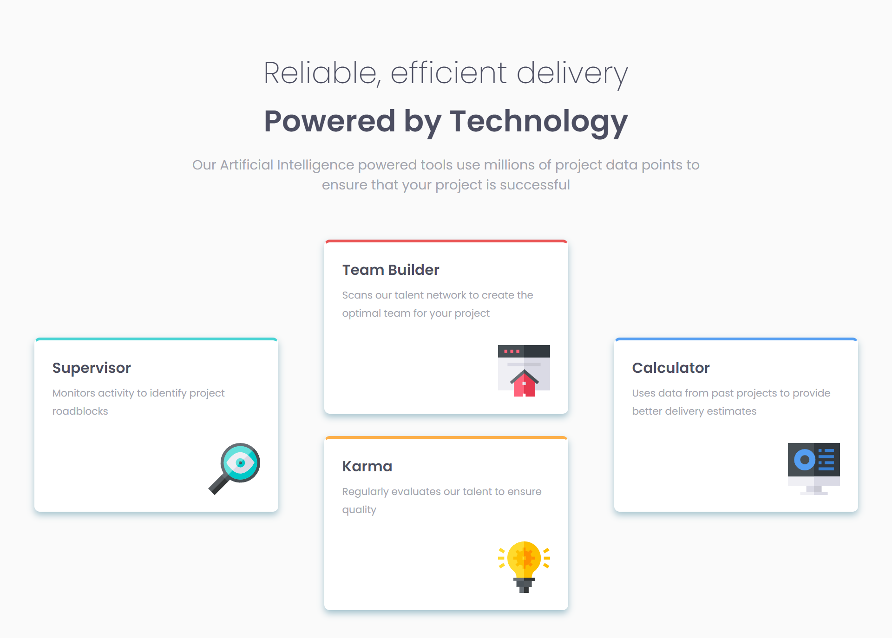

# Frontend Mentor - Four card feature section solution

This is a solution to the [Four card feature section challenge on Frontend Mentor](https://www.frontendmentor.io/challenges/four-card-feature-section-weK1eFYK). Frontend Mentor challenges help you improve your coding skills by building realistic projects.

## Table of contents

- [Overview](#overview)
  - [The challenge](#the-challenge)
  - [Screenshot](#screenshot)
  - [Links](#links)
- [My process](#my-process)
  - [Built with](#built-with)
  - [What I learned](#what-i-learned)
  - [Continued development](#continued-development)
  - [Useful resources](#useful-resources)
- [Author](#author)
- [Acknowledgments](#acknowledgments)

## Overview

### The challenge

Users should be able to:

- View the optimal layout for the site depending on their device's screen size

### Screenshot



### Links

- Live Site URL: [Live site URL here](https://four-card-section-livid.vercel.app/)

## My process

### Built with

- Semantic HTML5 markup
- CSS custom properties
- Flexbox
- CSS Grid
- Mobile-first workflow

### What I learned

During this project, I enhanced my understanding of CSS Grid and Flexbox, which are powerful layout systems in CSS. I also got more comfortable with the mobile-first approach, which ensures the design is responsive and works well on all device sizes.

Here's a code snippet I'm particularly proud of:

```html
<h1>Some HTML code I'm proud of</h1>
```

```css
.proud-of-this-css {
  color: papayawhip;
}
```

```js
const proudOfThisFunc = () => {
  console.log("🎉");
};
```

### Continued development

In future projects, I want to continue focusing on advanced CSS techniques and exploring JavaScript frameworks like React and Next.js. Additionally, I aim to refine my understanding of responsive design and accessibility to create more inclusive web applications.

### Useful resources

- [CSS Grid Layout Guide](https://css-tricks.com/snippets/css/complete-guide-grid/) - This guide helped me understand CSS Grid layout.
- [MDN Web Docs](https://developer.mozilla.org/) - An excellent resource for web development concepts and documentation.

## Author

- Frontend Mentor - [@omk1r](https://www.frontendmentor.io/profile/omk1r)
- Twitter - [@omk1rJ](https://www.twitter.com/omk1rJ)

## Acknowledgments

I would like to thank the Frontend Mentor community for providing such engaging challenges and valuable feedback. Special thanks to [specific person or resource] for their support and inspiration throughout this project.

---
